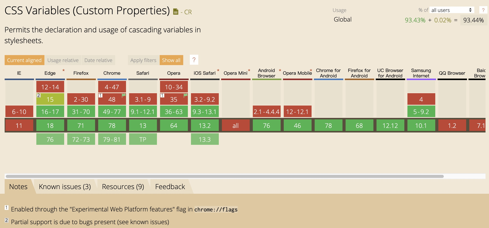

# umi-plugin-theme-switch

[](https://npmjs.org/package/umi-plugin-theme-switch)
[](https://npmjs.org/package/umi-plugin-theme-switch)

基于[css变量](https://developer.mozilla.org/zh-CN/docs/Web/CSS/Using_CSS_custom_properties)实现主题切换的umi插件

Umi plugin for theme switching based on css variables.

## Install

```bash
# or yarn
$ npm install umi-plugin-theme-switch
```

## Usage

Configure in `.umirc.js`,

```js
export default {
  plugins: [
    ['umi-plugin-theme-switch', options],
  ],
}
```

## Examples

[Examples](https://github.com/wxul/umi-plugin-theme-switch/tree/master/examples)

## Options

***

### `themes`

Type: `string | UmiPluginThemeItem`
Required: `true`

主题列表，类型为string时表示主题列表目录，目录下的`.json|.js`都会被解析成主题配置

examle: 
`src/themes/dark.json`
```
{
  "--bg-global": "#333",
  "--font-color": "#ddd"
}
```
`.umirc.js`
```js
export default {
  plugins: [
    ['umi-plugin-theme-switch', {
      themes: 'src/themes'
    }],
  ],
}
```

也可以不用配置目录，example:
``` js
export default {
  plugins: [
    ['umi-plugin-theme-switch', {
      themes: [{
        name: 'light',
        variables: {
          '--bg-global': '#ddd'
          '--font-color': '#333'
        }
      }, {
        name: 'dark',
        variables: {
          '--bg-global': '#333'
          '--font-color': '#ddd'
        }
      }]
    }],
  ],
}
```

***

### `defaultTheme`

Type: `string`

Default: 默认为上面themes数组的第一个主题

默认主题，不传的话默认为themes里第一项

***

### `scope`

Type: `string`

Default: `:root`

主题作用域，建议使用`:root`或者`body`或者app的根节点例如`#root`，否则如果设置了`remember`或者`autoDetectDarkMode`，页面会在render之前设置主题，尚未渲染出的元素将不会生效

***

### `attribute`

Type: `string`

Default: `umi-theme`

css变量的作用域是根据`scope`+属性选择器`[umi-theme=theme]`来确定的，如果想要自定义属性选择器的名字，可以更改此选项

***

### `remember`

Type: `boolean`

Default: `false`

新打开页面时是否自动选用上次选择过的主题，每次切换时会写入 `localStorage.setItem('umi_theme',theme)` 

***

### `autoDetectDarkMode`

Default: `null`

自动检测浏览器的dark模式并设置主题

如果同时启用`remember`和`autoDetectDarkMode`，则只有首次打开页面时会自动检测

#### `autoDetectDarkMode.enable`

Type: `boolean`

启用自动检测浏览器的dark模式

#### `autoDetectDarkMode.darkTheme`

Type: `string`

Default: `dark`

浏览器dark模式对应的主题配置名称

***

## Functions

`import {getTheme, switchTheme} from 'umi-plugin-theme-switch';`

#### `getTheme(): string`

获取当前的主题名

#### `switchTheme(theme: string): void`

切换主题

## ENV

`UMI_THEME_SCOPE` : 主题作用域，为选择器字符串

`UMI_THEME_ATTRIBUTE` : 主题产生作用的属性，默认为 umi-theme

## 兼容性



由于css变量不支持ie11，所以ie11可能需要一些解决方案 [nuxodin/ie11CustomProperties](https://github.com/nuxodin/ie11CustomProperties)

## LICENSE

MIT
